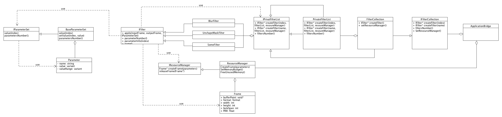
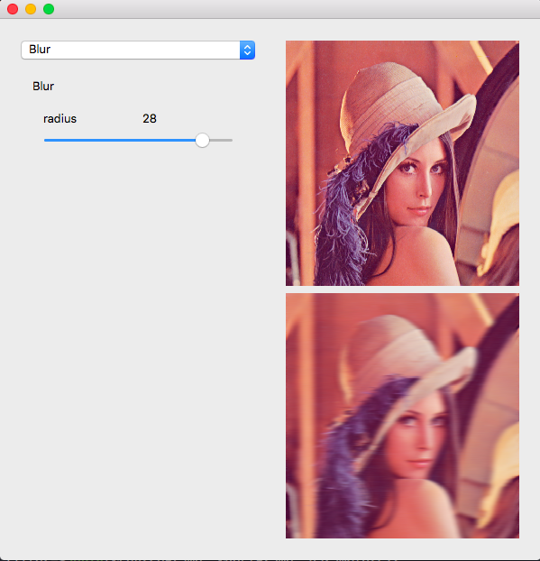

# Filters
It is simple image process C++ library. 

Current class diagram is here:

This library will be used by host application.

# Test UI

We also have application to test filters. Currently it is too simple. Here is screenshot:

